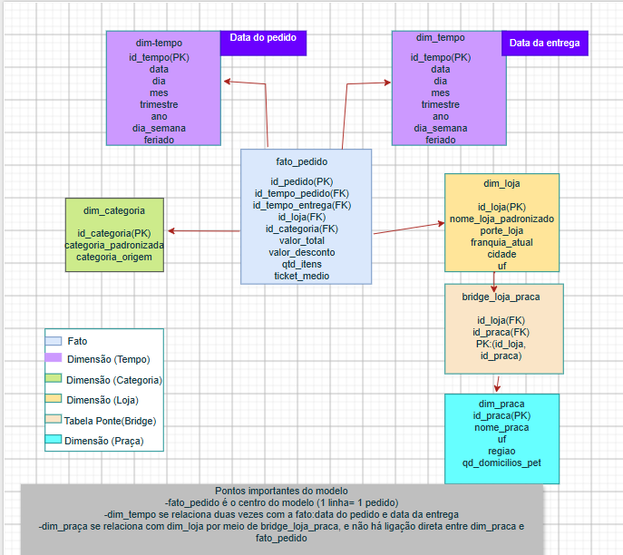

# Pata Amiga - Rede de Petshops de Santa Catarina

## 1. Diagnóstico da origem

Primeiro, fiz uma análise dos dados da origem para entender a estrutura e identificar os principais problemas que precisariam ser tratados durante a modelagem.

Conferi as colunas da tabela de staging e identifiquei que os dados estavam armazenados como VARCHAR, inclusive datas e valores numéricos. Também encontrei diferenças de preenchimento, grafia e padronização.

| Diagnóstico                        | Resultado |
| ----------------------------------- | --------: |
| Grafias diferentes de categoria     |        18 |
| Grafias diferentes de loja          |        50 |
| Valores diferentes em HouveDesconto |        12 |
| Valores diferentes em CanalPedido   |         8 |
| Pedidos sem CodLoja                 |     1.575 |
| Pedidos sem nome da loja            |         3 |

Também conferi os campos relacionados às etapas do pedido e identifiquei registros sem data de entrega. Esses registros representam pedidos que ainda estavam em aberto no período analisado, e não valores iguais a zero.

A partir desse diagnóstico, defini as regras que seriam usadas nas próximas etapas. Mantive a tabela de staging sem alterações e fiz os tratamentos durante a carga das dimensões e da tabela fato.

Para as lojas, fiz a normalização dos nomes antes de realizar o relacionamento com a dimensão. Também considerei as diferenças de maiúsculas, minúsculas e acentuação tratadas pelo próprio MySQL.

Para os registros sem informação suficiente para o relacionamento, utilizei a chave  -1, representando Não Informado.

## 2. Tratamento e padronização dos dados

Depois do diagnóstico, fiz o tratamento dos dados durante a carga das tabelas dimensionais e da tabela fato, mantendo os dados originais da staging preservados.

Nas datas, considerei os diferentes formatos encontrados na origem. A data e hora do pedido estava no formato MM/DD/YYYY AM/PM, enquanto as datas dos processos estavam no formato YYYY-MM-DD.

Também tratei os valores numéricos, removendo símbolos e ajustando separadores de milhar e decimal antes da conversão para os tipos numéricos.

Para as categorias, apliquei uma regra de precedência para evitar classificações incorretas. Por exemplo, Ração Medicamentosa foi classificada como Medicamento, e não como Ração.

As categorias foram padronizadas conforme as regras definidas no projeto:

* MED → Medicamento
* PETISC → Petisco
* RA → Racao
* HIG → Higiene
* BRINQ → Brinquedo
* ACESS → Acessorio
* SERV → Servico
* demais casos → Não Informado

Também normalizei os nomes das lojas antes do lookup. Corrigi algumas grafias identificadas na origem, como:

* PATA AMIGA BLUMENAL CENTRO - PATA AMIGA BLUMENAU CENTRO
* PATA AMIGA FLORIPA NORTE - PATA AMIGA FLORIANOPOLIS NORTE
* PATA AMIGA JGUA DO SUL - PATA AMIGA JARAGUA DO SUL

Nos campos de desconto e canal do pedido, também considerei as diferentes formas de preenchimento encontradas na origem e padronizei os valores durante a carga.

Para os campos sem informação, utilizei Não Informado quando não era possível identificar corretamente o valor.

## 3. Modelo dimensional

Depois do tratamento, montei o modelo dimensional no formato de estrela, com a tabela fato_pedido no centro e as dimensões ao redor.

Considerei como grão da fato uma linha para cada pedido. Dessa forma, a tabela fsto_pedido possui 4.044 registros, correspondendo aos 4.044 pedidos da origem.

As dimensões utilizadas foram:

* dim_tempo
* dim_loja
* dim_categoria
* dim_praca

Também utilizei a tabela bridge_loja_prqaca para fazer o relacionamento entre lojas e praças, permitindo aplicar o fator de rateio do faturamento.

A dimensão tempo é utilizada duas vezes na fato: uma para a data do pedido e outra para a data da entrega.

Em todas as dimensões, incluí a chave -1, correspondente a Não Informado. Essa decisão permitiu manter os registros da fato mesmo quando alguma informação da origem estava ausente.

O relacionamento entre dim_praca e fato_pedido não é feito diretamente. A praça é relacionada à loja por meio da bridge_loja_praca, que também contém o fator de rateio utilizado nas análises.

O diagrama abaixo representa o modelo dimensional que construí:

## 4. Validação e conferência do modelo

Depois de criar as dimensões e a tabela fato, fiz as conferências para verificar se os dados estavam sendo carregados corretamente e se os relacionamentos do modelo estavam íntegros.

Também conferi as dimensões:

| Tabela            | Registros |
| ----------------- | --------: |
| dim_tempo         |       236 |
| dim_loja          |        33 |
| dim_categoria     |        19 |
| dim_praca         |        13 |
| bridge_loja_praca |        48 |
| fato_pedido       |     4.044 |

Depois, validei as chaves estrangeiras da fato. Não encontrei chaves estrangeiras nulas nem registros órfãos nos relacionamentos com as dimensões.

Também conferi os casos que deveriam utilizar a chave -1. Encontrei 3 pedidos sem informação de loja e 1.953 pedidos sem data de entrega, que permaneceram associados ao registro Não Informado da dimensão tempo.

Fiz ainda algumas conferências específicas para validar as regras de tratamento. Entre elas:

* confirmei que os pedidos pelo canal WhatsApp não foram classificados como App;
* confirmei que não existiam intervalos negativos entre as etapas do pedido;
* conferi o período das datas, de 01/09/2023 a 31/03/2024;
* confirmei que Ração Medicamentosa foi classificada como Medicamento;
* conferi que a dimensão categoria ficou com 7 categorias de negócio, além do registro Não Informado;
* conferi a aplicação do relacionamento entre lojas e praças por meio da bridge_loja_praca.

Com essas validações, confirmei que a tabela fato possui os 4.044 pedidos da origem e que o modelo dimensional está consistente para realizar as cinco análises solicitadas no projeto.

## 5. Respostas e análise das perguntas de negócio

Nesta etapa, respondi às cinco perguntas propostas no projeto utilizando os dados tratados e o modelo dimensional que construí.

Para cada pergunta, apresentei o resultado obtido nas consultas e fiz uma análise dos dados. As respostas foram usadas para identificar os principais pontos de atenção e apoiar a recomendação final do projeto.

P1: Onde está o gargalo da entrega?

Para analisar o tempo de entrega, comparei os intervalos entre as principais etapas do pedido, separando os resultados pelo porte da loja.

| Porte da loja  | Integração - Separação | Separação - Nota | Nota - Despacho | Despacho - Entrega | Tempo Total(dias) |
| -------------- | -------------------------: | -----------------: | --------------: | -----------------: | ----------------: |
| Pequena        |                       3,02 |               0,69 |            8,53 |               2,86 |             15,16 |
| Média         |                       1,98 |               0,62 |            3,34 |               2,03 |              7,95 |
| Grande         |                       1,96 |               0,64 |            3,32 |               2,01 |              7,93 |
| Não Informado |                       2,00 |               0,00 |            4,00 |               3,00 |              8,50 |

Os resultados mostram que o maior intervalo ocorre entre  Nota-Despacho , principalmente nas lojas de pequeno porte, com média de  8,53 dias .

Nas lojas médias e grandes, esse intervalo fica em torno de 3,3 dias. Por isso, essa etapa merece atenção, principalmente nas lojas pequenas.

O grupo Não Informado foi mantido na tabela para representar os dados existentes na base, mas não foi utilizado para avaliar o desempenho dos portes de loja.

P2: Qual categoria concentra o faturamento?

Para responder essa pergunta, analisei o faturamento rateado por categoria de produto ou serviço.

| Categoria   | Faturamento (R$) | Participação |
| ----------- | ---------------: | -------------: |
| Racao       |     1.076.202,55 |         60,01% |
| Medicamento |       305.904,03 |         17,06% |
| Petisco     |       128.590,16 |          7,17% |
| Servico     |        94.001,37 |          5,24% |
| Higiene     |        92.314,45 |          5,15% |
| Acessorio   |        64.661,39 |          3,61% |
| Brinquedo   |        31.634,56 |          1,76% |

A categoria Racao representa a maior parte do faturamento, com R$ 1.076.202,55, correspondendo a 60,01% do total analisado.

A categoria Racao também foi a que apresentou o maior faturamento nos três portes de loja:

* Grande: R$ 468.186,60
* Média: R$ 443.131,62
* Pequena: R$ 164.197,55

P3: O desconto funciona igual em todo canal?

Para responder essa pergunta, comparei o ticket médio dos pedidos com e sem desconto dentro de cada canal de venda. Também calculei quanto cada canal representa do faturamento total da rede.

| Canal de Pedido | Ticket Médio COM Desconto | Ticket Médio SEM Desconto | Faturamento no Canal (R$) | % Faturamento Total |
| --------------- | -------------------------: | -------------------------: | ------------------------: | ------------------: |
| App             |                     488,04 |                     167,63 |                552.134,43 |              30,79% |
| Site            |                     501,92 |                     189,68 |                450.569,37 |              25,13% |
| Loja Física    |                     494,04 |                     197,55 |                360.677,22 |              20,11% |
| WhatsApp        |                     514,33 |                     179,26 |                188.678,63 |              10,52% |
| Telefone        |                     514,02 |                     195,23 |                123.419,29 |               6,88% |
| Não Informado  |                     561,59 |                     206,95 |                117.829,57 |               6,57% |

Não, o desconto não apresenta exatamente o mesmo comportamento em todos os canais. Em todos os canais identificados, os pedidos com desconto tiveram ticket médio maior do que os pedidos sem desconto, mas a diferença entre os dois valores varia de canal para canal. O maior faturamento está concentrado no App e no Site, que juntos representam 55,92% do faturamento total da rede.

Os dados mostram, portanto, que a política de desconto está associada a tickets maiores em todos os canais, mas o impacto observado não é igual entre eles. Isso indica que a política poderia ser analisada de forma diferente para cada canal, considerando o perfil de compra e a participação de cada um no faturamento.

Essa análise mostra uma associação entre desconto e ticket médio maior, mas não permite afirmar que o desconto foi a causa do aumento.

P4: Qual praça de atendimento concentra o faturamento?

Para responder essa pergunta, distribuí o faturamento das lojas entre as praças de atendimento utilizando o percentual de público definido na bridge_loja_praca. Depois, comparei o faturamento rateado com o número de domicílios com pet de cada praça.

| Nome da Praça       | Regional       | Domicílios com Pet | Faturamento Rateado (R$) | % Faturamento Total |
| -------------------- | -------------- | ------------------: | -----------------------: | ------------------: |
| Vale do Itajai       | Regional Leste |             148.000 |               633.746,09 |              35,34% |
| Grande Florianopolis | Regional Leste |             132.000 |               283.546,75 |              15,81% |
| Norte Industrial     | Regional Norte |              96.000 |               175.431,90 |               9,78% |
| Litoral Sul          | Regional Sul   |              58.000 |               137.051,20 |               7,64% |
| Litoral Norte        | Regional Norte |              61.000 |               128.872,75 |               7,19% |
| Extremo Oeste        | Regional Oeste |              63.000 |                98.359,18 |               5,48% |
| Carbonifera          | Regional Sul   |              67.000 |                88.707,42 |               4,95% |
| Serra Catarinense    | Regional Oeste |              44.000 |                80.477,64 |               4,49% |
| Meio-Oeste           | Regional Oeste |              51.000 |                58.955,63 |               3,29% |
| Foz do Itajai        | Regional Leste |              74.000 |                46.749,72 |               2,61% |
| Planalto Norte       | Regional Norte |              33.000 |                31.100,84 |               1,73% |
| Planalto Serrano     | Regional Oeste |              29.000 |                29.323,10 |               1,64% |

A praça que concentra o maior faturamento rateado é a Vale do Itajai, com R$ 633.746,09, equivalente a 35,34% do faturamento total da rede. Ela também possui o maior número de domicílios com pet entre as praças analisadas, com 148.000.

P5: Onde abrir a próxima loja, e o que os dados NÃO permitem afirmar?

a. Ranqueie as lojas por itens vendidos por mil habitantes da cidade – não em valor absoluto – e cruze com o tempo médio de entrega.

Para analisar essa questão, ranqueei as lojas pela quantidade de itens vendidos proporcionalmente à população da cidade, usando a medida de itens vendidos por mil habitantes. Em seguida, comparei esse indicador com o tempo médio de entrega.

| Loja                                 | Cidade                    | População | Total de Itens | Itens / 1.000 Hab. | Tempo Médio Entrega (Dias) |
| ------------------------------------ | ------------------------- | ----------: | -------------: | -----------------: | --------------------------: |
| Pata Amiga Rio dos Cedros            | Rio dos Cedros            |      11.322 |            474 |              41,87 |                       14,24 |
| Pata Amiga Presidente Getulio        | Presidente Getúlio       |      16.359 |            570 |              34,84 |                       14,16 |
| Pata Amiga Ibirama                   | Ibirama                   |      18.613 |            597 |              32,07 |                       15,39 |
| Pata Amiga Itapoa                    | Itapoá                   |      20.586 |            534 |              25,94 |                       15,39 |
| Pata Amiga Santo Amaro da Imperatriz | Santo Amaro da Imperatriz |      22.357 |            530 |              23,71 |                       15,88 |
| Pata Amiga Taio                      | Taió                     |      18.173 |            352 |              19,37 |                       14,57 |
| Pata Amiga Timbo                     | Timbó                    |      45.011 |            804 |              17,86 |                        7,70 |
| Pata Amiga Gaspar                    | Gaspar                    |      71.133 |          1.189 |              16,72 |                        8,01 |
| Pata Amiga Otacilio Costa            | Otacílio Costa           |      18.227 |            289 |              15,86 |                       15,61 |
| Pata Amiga Ituporanga                | Ituporanga                |      25.748 |            354 |              13,75 |                       16,53 |
| Pata Amiga Rio do Sul                | Rio do Sul                |      73.135 |            885 |              12,10 |                        8,35 |
| Pata Amiga Sao Joaquim               | São Joaquim              |      27.234 |            320 |              11,75 |                       15,07 |
| Pata Amiga Laguna                    | Laguna                    |      46.122 |            541 |              11,73 |                        8,51 |
| Pata Amiga Indaial                   | Indaial                   |      71.987 |            750 |              10,42 |                        7,74 |
| Pata Amiga Ararangua                 | Araranguá                |      68.274 |            689 |              10,09 |                        8,25 |
| Pata Amiga Tubarao                   | Tubarão                  |     105.511 |            889 |               8,43 |                        7,69 |
| Pata Amiga Jaragua do Sul            | Jaraguá do Sul           |     184.579 |          1.440 |               7,81 |                        8,01 |
| Pata Amiga Curitibanos               | Curitibanos               |      39.061 |            308 |               7,89 |                        8,65 |
| Pata Amiga Sao Bento do Sul          | São Bento do Sul         |      87.310 |            567 |               6,49 |                        8,18 |
| Pata Amiga Concordia                 | Concórdia                |      74.641 |            470 |               6,30 |                        7,74 |
| Pata Amiga Blumenau Centro           | Blumenau                  |     361.855 |          2.002 |               5,53 |                        7,80 |
| Pata Amiga Xanxere                   | Xanxerê                  |      52.034 |            284 |               5,46 |                        8,17 |
| Pata Amiga Palhoca                   | Palhoça                  |     168.259 |            845 |               5,02 |                        7,69 |
| Pata Amiga Sao Miguel do Oeste       | São Miguel do Oeste      |      41.520 |            186 |               4,48 |                        8,00 |
| Pata Amiga Brusque                   | Brusque                   |     143.270 |            558 |               3,89 |                        7,63 |
| Pata Amiga Criciuma                  | Criciúma                 |     217.392 |            822 |               3,78 |                        8,07 |
| Pata Amiga Lages                     | Lages                     |     158.846 |            593 |               3,73 |                        7,69 |
| Pata Amiga Sao Jose Kobrasol         | São José                |     250.181 |            929 |               3,71 |                        8,01 |
| Pata Amiga Chapeco                   | Chapecó                  |     254.235 |            824 |               3,24 |                        7,85 |
| Pata Amiga Joinville Sul             | Joinville                 |     597.658 |          1.888 |               3,16 |                        7,83 |
| Pata Amiga Itajai Praia              | Itajaí                   |     264.054 |            798 |               3,02 |                        7,98 |
| Pata Amiga Florianopolis Norte       | Florianópolis            |     537.213 |          1.426 |               2,65 |                        8,02 |

A loja de Rio dos Cedros apresentou a maior demanda proporcional, com 41,87 itens vendidos por mil habitantes. Porém, o tempo médio de entrega foi de 14,24 dias. O resultado mostra que uma maior demanda proporcional não significa necessariamente uma operação mais eficiente, sendo importante analisar esse indicador em conjunto com o tempo de entrega e a capacidade de atendimento.

Dessa forma, Rio dos Cedros se destaca como uma praça que merece ser considerada em uma análise de expansão, mas os dados disponíveis não são suficientes, isoladamente, para afirmar que a cidade é o melhor local para abrir uma nova loja.

Para analisar essa questão, agrupei o faturamento de acordo com a faixa de franquia atualmente registrada no cadastro das lojas.

| Faixa de Franquia Atual | Faturamento Total (R$) | % Faturamento Total |
| ----------------------- | ---------------------: | ------------------: |
| Ouro                    |           1.011.264,38 |              56,39% |
| Diamante                |             382.209,74 |              21,31% |
| Prata                   |             314.812,03 |              17,55% |
| Bronze                  |              84.036,06 |               4,69% |
| Não Informado          |                 986,30 |               0,05% |

b. A faixa de franquia no cadastro é a de hoje: o passado foi sobrescrito. Mostre o faturamento por faixa ATUAL e explique por que isso não responde “quanto veio de lojas que JÁ ERAM Ouro na data do pedido”.

Pela classificação atual, as lojas da faixa Ouro concentram o maior faturamento, com R$ 1.011.264,38, equivalente a 56,39% do faturamento total.

Porém, esse resultado não permite afirmar quanto foi faturado por lojas que já eram Ouro na data de cada pedido. Isso acontece porque o cadastro apresenta a faixa atual e o histórico das alterações foi sobrescrito. Uma loja que hoje está classificada como Ouro pode ter realizado parte desses pedidos quando ainda pertencia a outra faixa.

Assim, o resultado permite analisar o faturamento segundo a classificação atual, mas não reconstruir a evolução histórica das faixas de franquia.

c. Meça o que ficou de fora: pedidos sem loja identificada, entregas ainda não concluídas, itens e valores em branco.

Para avaliar as limitações da base, conferi quantos registros ficaram sem informação em pontos importantes para a análise.

| Indicador                     | Quantidade |
| ----------------------------- | ---------: |
| Pedidos sem loja identificada |          3 |
| Entregas não concluídas     |      1.953 |
| Itens em branco               |        257 |
| Valores em branco             |        121 |

Dos 4.044 pedidos analisados, 3 não possuem loja identificada e 1.953 não possuem entrega concluída dentro do período da base. Também foram encontrados 257 registros com itens em branco e 121 com valores em branco.

Esses registros representam limitações importantes da análise, principalmente os pedidos ainda não concluídos e os campos com informações ausentes, pois podem afetar a interpretação dos resultados e das comparações realizadas no projeto.

Conclusão:  Com base nos dados analisados, Rio dos Cedros aparece como a principal candidata para uma nova loja, por apresentar a maior demanda proporcional, com 41,87 itens vendidos por mil habitantes. Porém, o tempo médio de entrega de 14,24 dias mostra que existe também um desafio operacional. Por isso, os dados indicam Rio dos Cedros como uma oportunidade a ser investigada, mas não são suficientes, sozinhos, para afirmar que esse é o melhor local para a abertura da próxima loja.

## 6. Principais insights

A análise dos dados mostrou alguns pontos importantes sobre a operação da Pata Amiga.

* O principal gargalo da entrega está no intervalo entre Nota e Despacho. Esse problema aparece nos três portes de loja, mas é muito mais acentuado nas lojas pequenas, que apresentam também o maior tempo total médio até a entrega.
* A categoria Racao concentra 60,01% do faturamento da rede e continua sendo a categoria de maior faturamento nos três portes de loja. Isso mostra que ela tem um peso importante no resultado da operação.
* O comportamento observado nos descontos não é exatamente igual entre os canais. Em todos os canais, o ticket médio com desconto foi maior do que sem desconto, mas a diferença varia de um canal para outro. App e Site juntos representam 55,92% do faturamento da rede.
* A praça Vale do Itajai concentra o maior faturamento rateado, com 35,34% do total. A praça também possui a maior quantidade de domicílios com pet entre as praças analisadas.
* Na análise de expansão, Rio dos Cedros apresentou a maior demanda proporcional, com 41,87 itens vendidos por mil habitantes. Porém, o tempo médio de entrega de 14,24 dias mostra que existe também um desafio operacional que precisa ser considerado.

## 7. Conclusão geral

Com a construção do modelo dimensional e a análise dos 4.044 pedidos, consegui identificar pontos importantes da operação da Pata Amiga e responder às cinco perguntas propostas.

Os resultados mostram que existe espaço para melhorar principalmente o processo entre a emissão da nota e o despacho, especialmente nas lojas pequenas. Também ficou claro o peso da categoria Racao no faturamento e a importância dos canais digitais para a receita da rede.

Na análise de expansão, Rio dos Cedros aparece como uma oportunidade que merece ser investigada, por apresentar a maior demanda proporcional. Porém, o tempo elevado de entrega e as limitações encontradas na base mostram que essa informação, sozinha, não é suficiente para definir a abertura de uma nova loja.

Por isso, minha recomendação é utilizar os resultados deste projeto como base para uma análise de viabilidade mais completa, considerando capacidade operacional, logística, mercado local e qualidade dos dados antes de tomar a decisão final de expansão.

## 8. Estrutura dos Arquivos do Projeto no Git

Pasta Principal:

* .gitignore: Arquivo utilizado para definir quais arquivos e pastas não devem ser versionados no repositório.
* requirements.txt: Arquivo informativo sobre as dependências do projeto. Este projeto não utiliza bibliotecas Python externas.
* README.md: Documentação principal do projeto, contendo o diagnóstico da origem, tratamento dos dados, modelo dimensional, respostas às perguntas de negócio, insights e conclusão.

Pasta sql/:

* 01-carga-staging.sql: Realiza a carga dos dados brutos nas tabelas de staging, mantendo os dados da origem sem alterações.
* 02-dimensoes-prontas.sql: Cria a estrutura das tabelas dimensionais, da tabela fato e da tabela de relacionamento entre loja e praça.
* 03-dimensoes.sql: Realiza a carga, limpeza e padronização das dimensões, incluindo o tratamento das chaves e dos registros “Não Informado”.
* 04-fato.sql: Realiza a carga da tabela fato, aplicando as regras de tratamento necessárias aos pedidos e relacionando-os às dimensões.
* 05-perguntas.sql: Contém as consultas utilizadas para responder às cinco perguntas de negócio propostas no case.

Arquivos auxiliares:

* 00-conferencia.sql: Arquivo utilizado localmente para conferência e validação dos resultados durante o desenvolvimento. Não faz parte da entrega no GitHub.
* Pasta data/: Contém os arquivos CSV utilizados como fonte para a carga dos dados. Esses arquivos não são versionados no GitHub.
* Pasta imagens/: Contém as imagens utilizadas na documentação do projeto, incluindo o diagrama estrela do modelo dimensional.
* Pasta docs/: Destinada à documentação complementar do projeto.

## 9. Como Executar o Projeto

1. Baixe ou clone o repositório do GitHub.
2. Abra o MySQL Workbench e conecte-se ao MySQL 8.0.
3. Execute os scripts SQL na ordem apresentada abaixo:

   1. 01-carga-staging.sql
   2. 02-dimensoes-prontas.sql
   3. 03-dimensoes.sql
   4. 04-fato.sql
   5. 05-perguntas.sql
4. Após a execução, o banco de dados estará disponível para consultas e análises.
5. Para validação dos resultados durante o desenvolvimento, pode ser utilizado localmente o arquivo 00-conferencia.sql.
6. As consultas do projeto e seus resultados servem de base para a análise das perguntas de negócio e para a construção do dashboard no Power BI.
